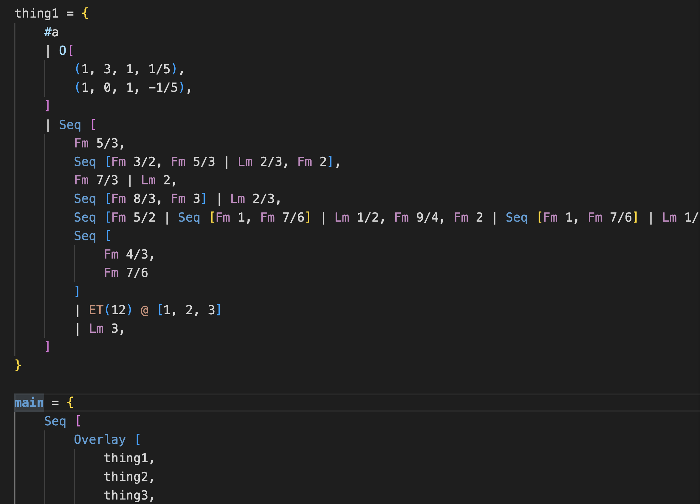

# WereSoCool VSCode Extension 
Very simple syntax highlighting for [WereSoCool](https://www.weresocool.org/) in VSCode.

### Content
* Vscode uses textmate grammars
* `syntaxes/socool.tmLanguage.json` - this is the Text mate grammar file that is used for tokenization.
* `language-configuration.json` - this is the language configuration, defining the tokens that are used for comments and brackets.

### Debugging
* Press `F5` to open a new vscode window with your extension loaded.

## Make changes
* You can relaunch the extension from the debug toolbar after making changes to the files listed above.
* You can also reload (`Ctrl+R` or `Cmd+R` on Mac) the VS Code window with your extension to load your changes.

## Publishing
See https://code.visualstudio.com/docs about publishing an extension.
